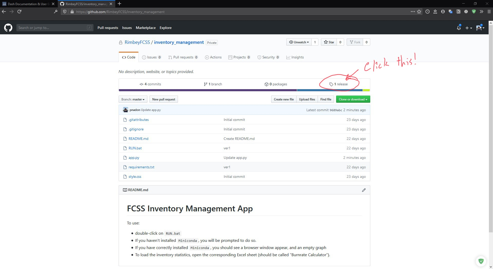
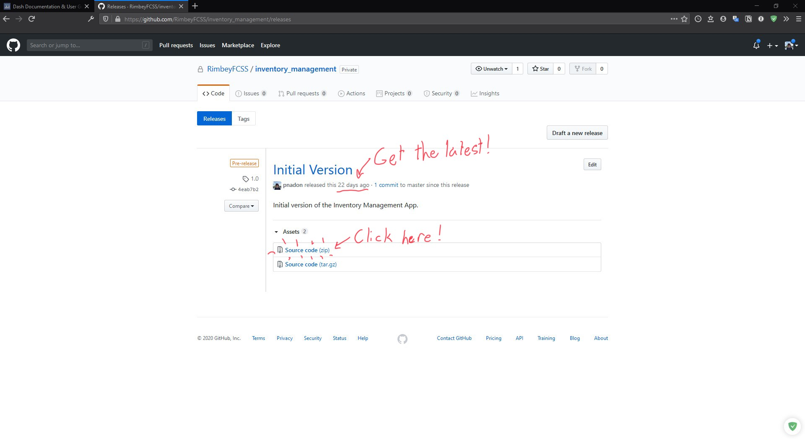
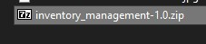
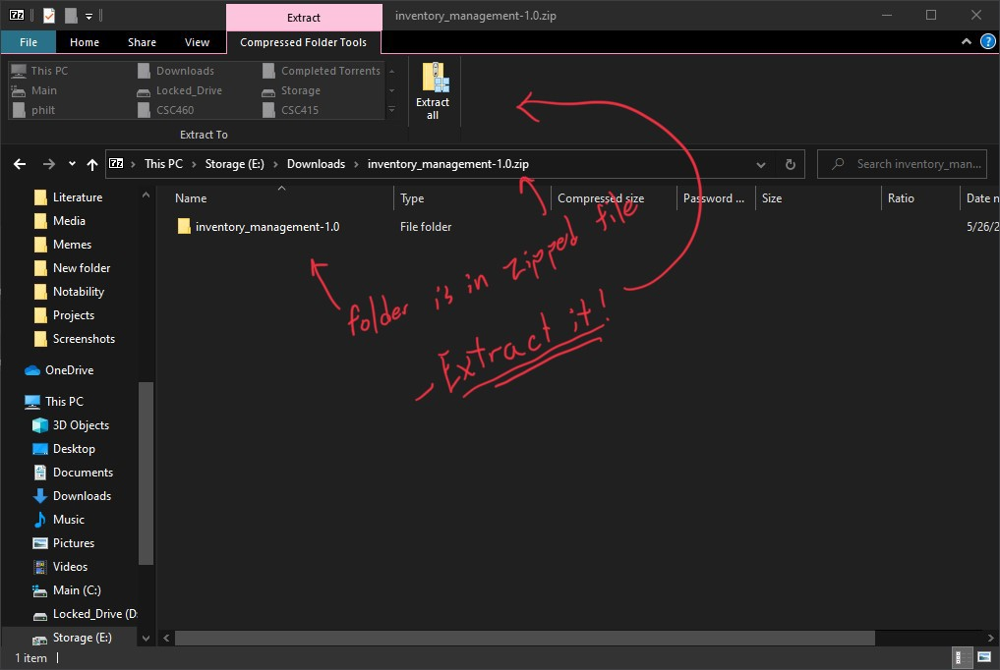
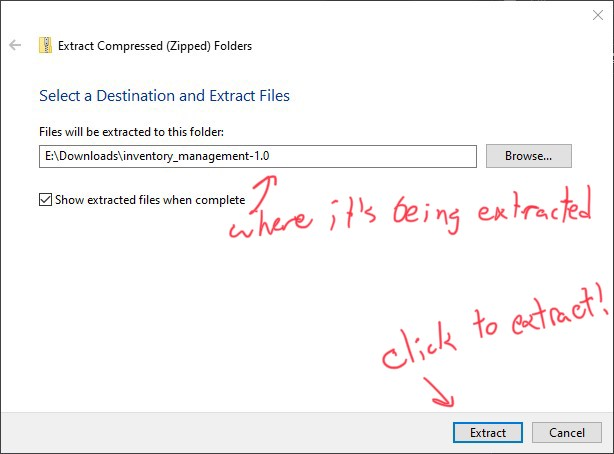
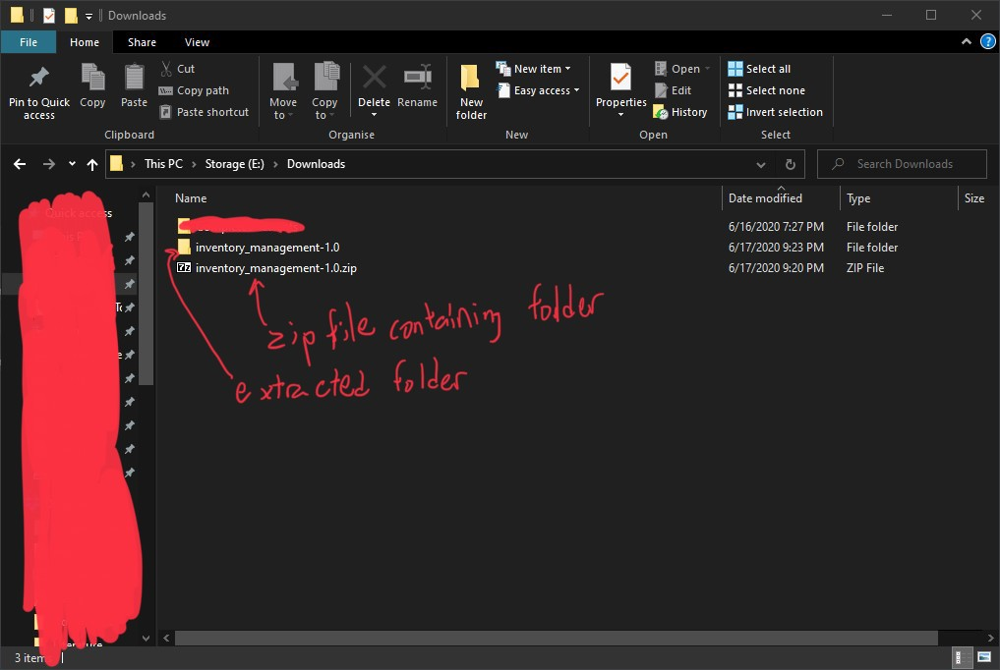
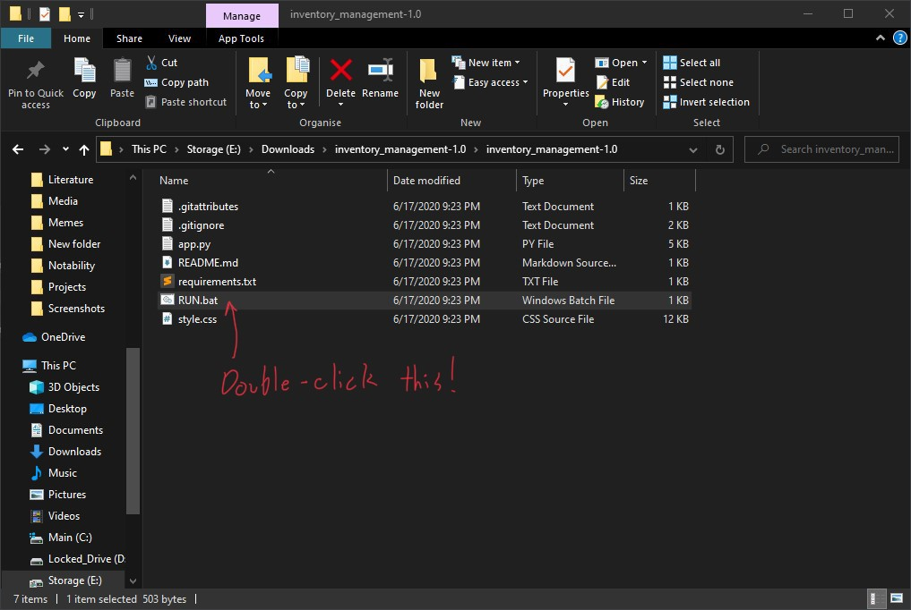
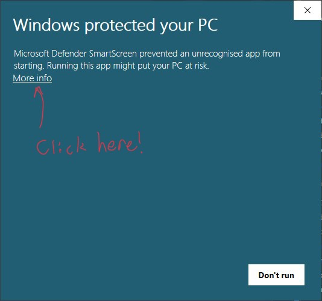
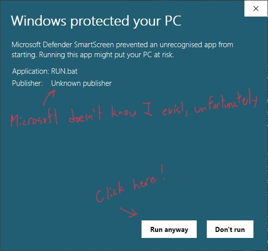
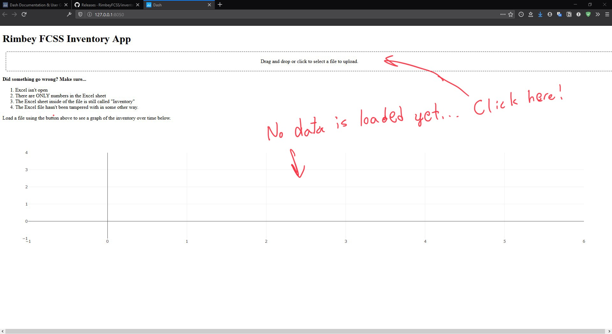

# Installation

## Installation of Visualizater component
1. The Visualizer can be installed by accessing the ["Releases" page](https://github.com/RimbeyFCSS/inventory_management/releases) on the [Github Respository](https://github.com/RimbeyFCSS/inventory_management) where this program is kept.

2. Make sure that you are signed into Github using the account that is part of [Rimbey FCSS's Github Organization](https://github.com/RimbeyFCSS).

3. Always choose the latest version unless otherwise specified. In "assets" choose "Source code (zip)", and a download should begin.

4. Once your download is complete, you will need to extract the "zip" (compressed) file. Right-click on the file and choose "extract", then once it is done you should see a folder appear next to the zipped file. Move this folder somewhere safe and easy to find, such as your Desktop.

(A zip file typically looks like one of the above)

5. Inside the folder, run the "RUN.bat" script, and you should see a prompt appear. If you do not have [MiniConda](https://docs.conda.io/en/latest/miniconda.html) installed, you will be prompted to download and install it. In this case (after installing it), continue to step 6, otherwise if you have Minoconda installed skip to step 7.

6. Download the Windows installer for Python 3.*, and install Conda for the local user. Once you are done installing MiniConda, close the prompt and try running RUN.bat again. 

7. If MiniConda was installed successfully you should see progress bars begin to appear and fill up. This means the necessary packages are being installed. Once that is done, you should see a window appear in your web browser (your web browser likely being either Google Chrome or Microsoft Edge).

## Syncing Sharepoint to your computer
It is recommended that you sync Sharepoint to your computer, so that the Excel sheet is available locally. This will allow you to easily access the Excel sheet from the Visualizer.