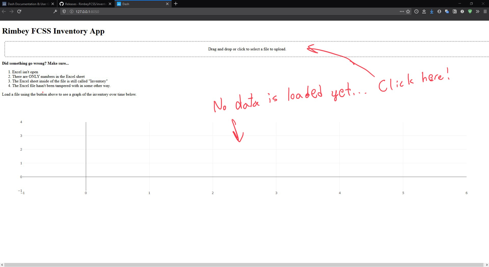

# Quick Start

First, follow the instructions in the installation section, *which you only need to do once per computer!*.

1. Find the folder that you extracted in the installation process. It was recommended to put it somewhere where you will find it easily, and this is why!

2. double-Click on the "RUN.bat" file to launch the program. You should see some progress bars and then a window appear in your browser. Otherwise, refer to the installation section.

3. You should see an empty graph like below (the current version may appear different, but the concepts are the same).

4. Press the wide button near the top to load the Excel sheet that corresponds to the form submissions. You should see a graph appear like below.

5. Make sure to play around with the controls in the top-right of the graph, one of which allows you to save the graph as an image!