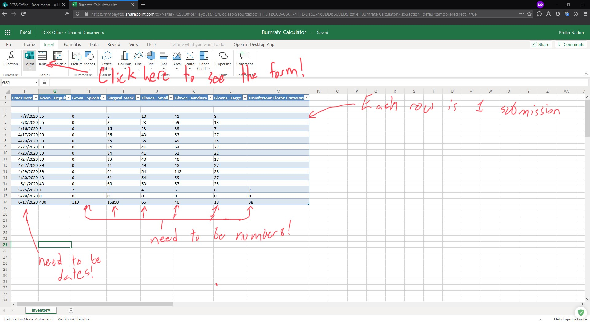

# Storage - Microsoft Excel

The Inventory Management service use Sharepoint to host the Excel sheet and Form, which allows it to be accessed from anywhere and by anyone who has access to the Sharepoint. The sheet itself is comprised of [Named Ranges](https://docs.microsoft.com/en-us/office/vba/excel/concepts/cells-and-ranges/refer-to-named-ranges), and rows that correspond to *unique* dates.

## About modifying the sheet

If everything is functioning as intended, there shouldn't be a reason to access the sheet. However, if one wishes to modify the names of certain inventory items, or to delete submissions, you will likely need to access the sheet.

### Deleting a submission
You can delete a submission by removing the corresponding row in the sheet. As long as *only that row* is deleted, everything should continue to work fine.